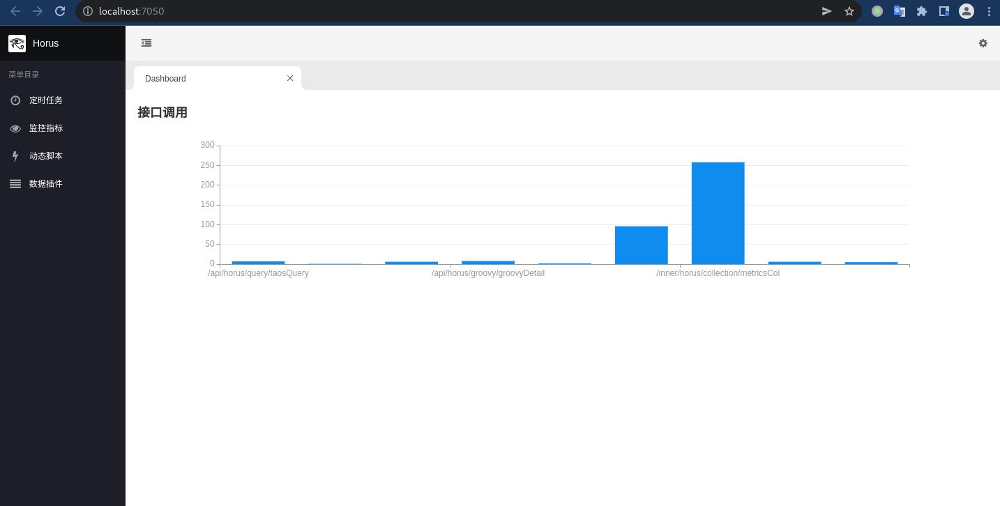
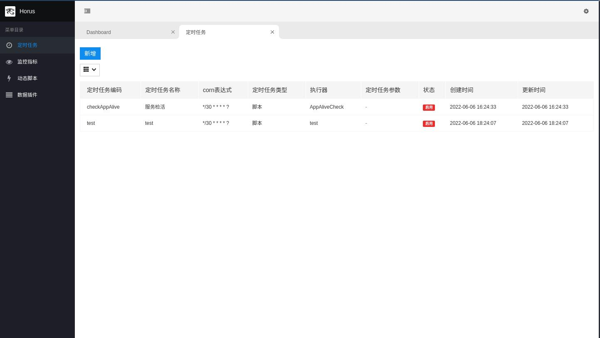
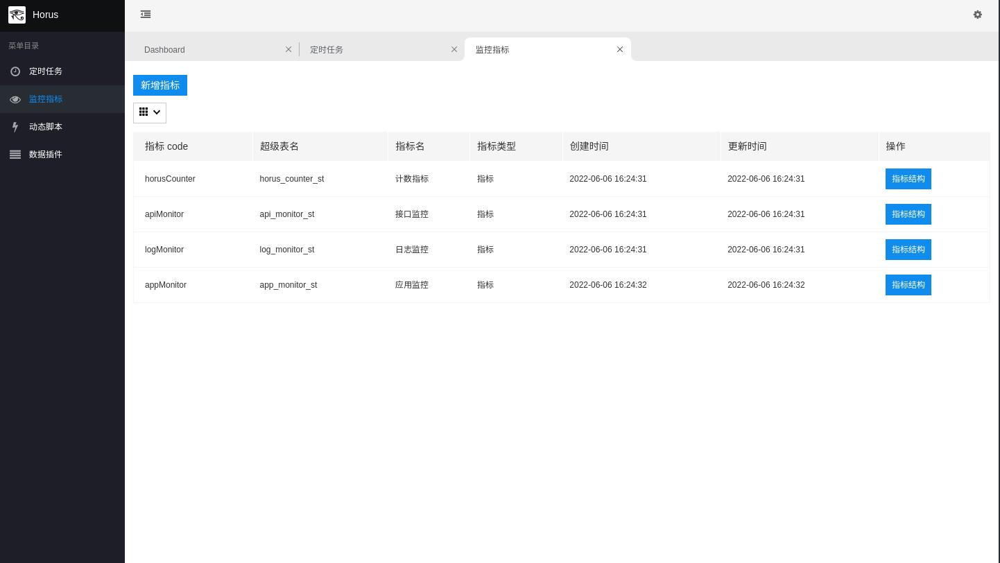
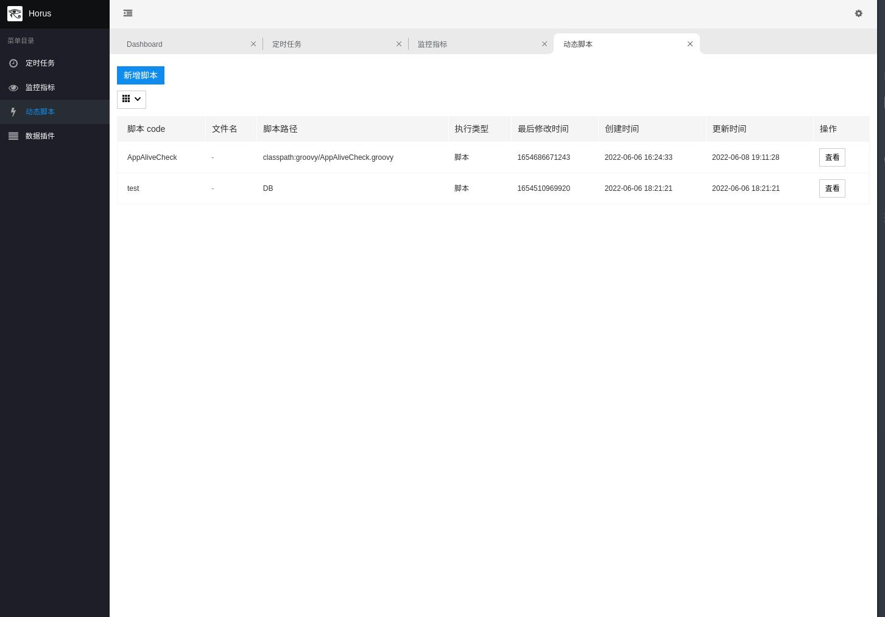
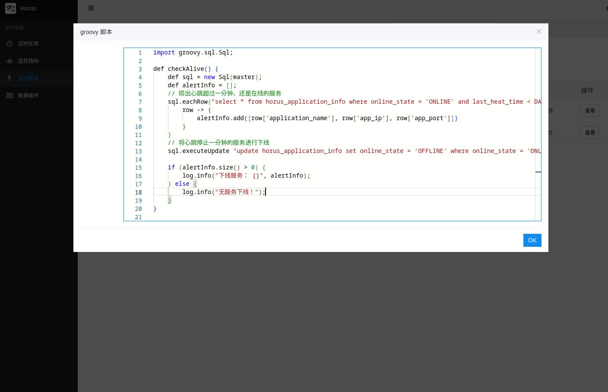

# Horus —— 基于 TDEngine 时序型数据库的业务监控

- 给予业务监控定制的高度自由

设计文档：https://akhnhwmr9k.feishu.cn/wiki/wikcnJJFmDHjpLZ3Kxmekcnorgg  
前端仓库地址：https://github.com/gunnerliu/horus-web  
archliu-common-starter 仓库地址：https://github.com/gunnerliu/archliu-common-starter  
nginx 日志监控：https://github.com/gunnerliu/horus_log_col  
TDEngine 官网：https://www.taosdata.com/?zh

## 项目启动配置

- 需要创建 application-private.yml
- 在 application-private.yml 中添加两个数据源 master、td

```yml
spring:
  datasource:
    dynamic:
      primary: master
      strict: false #严格匹配数据源,默认false. true未匹配到指定数据源时抛异常,false使用默认数据源
      datasource:
        master:
          url:
          username:
          password:
          druid:
            validation-query: SELECT 1
        td:
          driver-class-name: com.taosdata.jdbc.rs.RestfulDriver
          url:
          username:
          password:
          druid:
            validation-query: select server_status()

horus:
  server:
    reach-info:
      reacher-type: DING_TALK
      web-hook: webhook地址
      at-mobiles:
        - 需要@的手机号
    msg-aggregation-cycle: 30000
```

- dashboard
  
- 定时任务
  
- 监控指标
  
- 监控指标实体类
  
- groovy 动态脚本
  
- groovy 动态脚本
  
