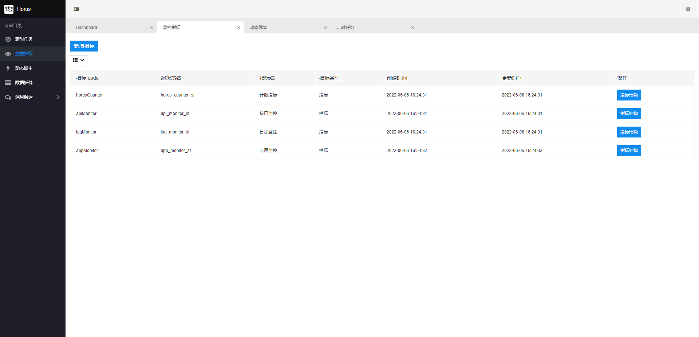

# Horus —— Highly customized business metrics monitoring with TDengine & Spring Boot

- 给予业务指标监控的高度定制自由

设计文档：https://akhnhwmr9k.feishu.cn/wiki/wikcnJJFmDHjpLZ3Kxmekcnorgg  
前端仓库地址：https://github.com/gunnerliu/horus-web  
archliu-common-starter 仓库地址：https://github.com/gunnerliu/archliu-common-starter  
nginx 日志监控插件：https://github.com/gunnerliu/horus_log_col  
TDEngine 官网：https://www.taosdata.com/?zh

## 项目功能简介

- 指标数据结构管理、导入导出，方便测试环境向生产环境同步数据
- groovy 动态脚本，基于文件&DB，实现热更新功能
- 基于 DB 的 cron 定时任务，执行历史记录，打通执行 groovy 脚本
- 指标数据采集接口，数据清洗插件
- TDengine & MySQL 查询接口
- 钉钉告警触达通道
- 提供默认基础通用插件：
  - 1、Spring MVC 接口监控
  - 2、基于 actuator 的 Spring Boot 服务应用监控 & 服务检活
  - 3、logback 框架 error 日志监控

## 项目启动配置

- 需要创建 application-private.yml
- 在 application-private.yml 中添加两个数据源 master、td

```yml
spring:
  datasource:
    dynamic:
      primary: master
      strict: false #严格匹配数据源,默认false. true未匹配到指定数据源时抛异常,false使用默认数据源
      datasource:
        master:
          url:
          username:
          password:
          druid:
            validation-query: SELECT 1
        td:
          driver-class-name: com.taosdata.jdbc.rs.RestfulDriver
          url:
          username:
          password:
          druid:
            validation-query: select server_status()

horus:
  server:
    reach-info:
      reacher-type: DING_TALK
      web-hook: webhook地址
      at-mobiles:
        - 需要@的手机号
    msg-aggregation-cycle: 30000
```

- dashboard
  
- 定时任务
  
- 监控指标
  
- 指标数据结构
  
- 监控指标实体类
  
- groovy 动态脚本
  
- 脚本内容
  
- 消息触达
  
